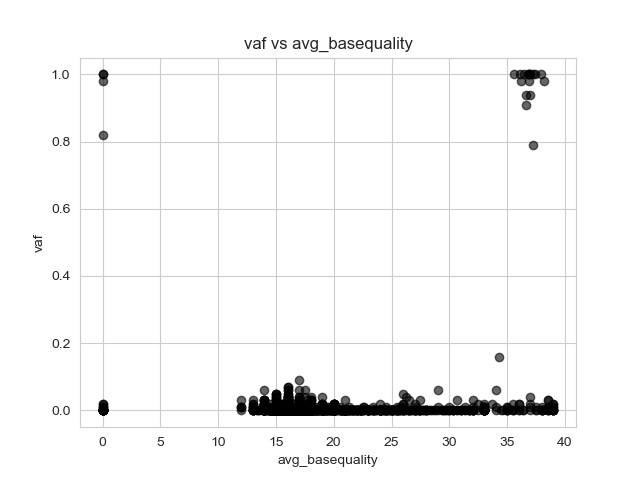
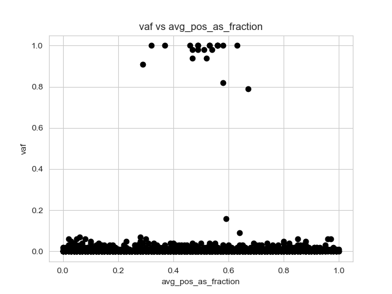

# A `bam-readcount` tutorial

On November 26, 2021, [WHO](https://www.who.int/)
[classified](https://www.who.int/news/item/26-11-2021-classification-of-omicron-(b.1.1.529)-sars-cov-2-variant-of-concern)
the
[SARS-CoV-2](https://en.wikipedia.org/wiki/Severe_acute_respiratory_syndrome_coronavirus_2)
[variant](https://covariants.org/) [`B.1.1.529`](https://covariants.org/variants/21K.Omicron) as a ["Variant of
Concern"](https://www.who.int/en/activities/tracking-SARS-CoV-2-variants/) (VOC), designated
"[Omicron](https://en.wikipedia.org/wiki/Omicron)". The variant was
noted as having an unusually large number of mutations, including more
than 30 in the
[Spike protein](https://en.wikipedia.org/wiki/Coronavirus_spike_protein).

On November 29, [Tulio de Oliveira](https://twitter.com/Tuliodna)
of [CERI](https://ceri.org.za/) [posted](https://twitter.com/Tuliodna/status/1465338678264401934) a
[link](https://www.ncbi.nlm.nih.gov/sra/?term=PRJNA784038) to the
[FASTQ](https://en.wikipedia.org/wiki/FASTQ_format) sequencing files for some
of the first sequenced Omicron cases. We can use
[`bam-readcount`](https://github.com/genome/bam-readcount) along with the
SARS-CoV-2 [reference genome](https://www.ncbi.nlm.nih.gov/nuccore/1798174254) and some common software to explore these mutations. Please
note that this is just an exercise and would surely not be street-legal in a
virology department!

The only requirement is [Docker](https://www.docker.com/) and access to a Unix
command line, although all the tools can be easily built locally instead. A 
ready-to-run Bash script containing all the commands is available 
[here](scripts/commands.sh)

## Docker setup

All Docker commands use similar arguments to allow us to access files in the
current working directory, so first we will define an alias with the
common options

    # --rm remove container on exit
    # -w $(pwd) set working directory to current working directory
    # -v $(pwd):$(pwd) map current working directory inside container
    alias dockercmd='docker run --rm -w $(pwd) -v $(pwd):$(pwd)'

and run Docker as

    dockercmd IMAGE ARGS...

All the computations can be run quickly on an ordinary laptop; no command
should take more than a minute to run. The Docker containers are also 
fairly small and should download quickly on a broadband connection.

If you are using a shell that does not support this `alias` format, you 
can just substitute the full command for `dockercmd` in the command
lines below.


## Download the reference and FASTQs

    # SARS-CoV-2 standard reference genome
    dockercmd curlimages/curl -o NC_045512.2.fa "https://eutils.ncbi.nlm.nih.gov/entrez/eutils/efetch.fcgi?db=nuccore&id=NC_045512.2&rettype=fasta"

    # CERI FASTQs via the SRA for case CERI-KRISP-K032274
    # We will use the SRA tools to download and convert to FASTQ
    # from the SRA format
    # URL: https://trace.ncbi.nlm.nih.gov/Traces/sra/?run=SRR17054502
    dockercmd ncbi/sra-tools fastq-dump --split-files --origfmt SRR17054502


## Index and align with `bwa` and `samtools`

[bwa](https://github.com/lh3/bwa) to align the sequence and
[samtools](http://www.htslib.org/) to convert, sort, and index the alignments

    # Index the reference genome
    dockercmd seqfu/alpine-bwa bwa index NC_045512.2.fa

    # Align the sequence
    dockercmd seqfu/alpine-bwa bwa mem NC_045512.2.fa SRR17054502_1.fastq SRR17054502_2.fastq > CERI-KRISP-K032274.sam

    # Convert to BAM and remove SAM output
    dockercmd seqfu/alpine-samtools-1.10 samtools view -b CERI-KRISP-K032274.sam > CERI-KRISP-K032274.bam
    rm CERI-KRISP-K032274.sam 

    # Sort BAM and remove unsorted BAM
    dockercmd seqfu/alpine-samtools-1.10 samtools sort CERI-KRISP-K032274.bam > CERI-KRISP-K032274.sorted.bam
    rm CERI-KRISP-K032274.bam

    # Index sorted BAM
    dockercmd seqfu/alpine-samtools-1.10 samtools index CERI-KRISP-K032274.sorted.bam


## Run `bam-readcount` on the S protein region

We're now ready to run `bam-readcount`. Here we will focus on the Spike (S) protein. 
The Genbank [reference](https://www.ncbi.nlm.nih.gov/gene/43740568) for S gives 
coordinates of `21563..25384` on the reference genome, so we will specify that
range to restrict `bam-readcount` output to S. We could specify mapping or 
base quality filters, but we will run it wide open and see what we get

    # -w1 Show any warnings only once; bam-readcount likes to complain about 
    #     missing SM tags for every read
    # -f  Specify the reference genome
    dockercmd mgibio/bam-readcount -w1 -f NC_045512.2.fa CERI-KRISP-K032274.sorted.bam NC_045512.2:21563-25384 > CERI-KRISP-K032274.brc.tsv


## A quick look at the output

The `bam-readcount` output is discussed in more detail below, but we
can quickly scan through the `bam-readcount` output and see what look like
some variants, for example

    NC_045512.2 21765 T 1615  =:0:0.00:0.00:0.00:0:0:0.00:0.00:0.00:0:0.00:0.00:0.00  A:0:0.00:0.00:0.00:0:0:0.00:0.00:0.00:0:0.00:0.00:0.00  C:0:0.00:0.00:0.00:0:0:0.00:0.00:0.00:0:0.00:0.00:0.00  G:0:0.00:0.00:0.00:0:0:0.00:0.00:0.00:0:0.00:0.00:0.00  T:3:60.00:33.00:0.00:1:2:0.09:0.05:77.00:1:0.01:100.33:0.35 N:0:0.00:0.00:0.00:0:0:0.00:0.00:0.00:0:0.00:0.00:0.00  -TACATG:1612:60.00:0.00:0.19:805:807:0.58:0.05:66.17:805:0.41:184.78:0.48

At position `21765`,  of `1615` reads, `1612` have a deletion `-TACATG`

    -TACATG:1612:60.00:0.00:0.19:805:807:0.58:0.05:66.17:805:0.41:184.78:0.48

`bam-readcount` provides a lot of information about each base or indel.
For example, the `60.00` is the (good) average mapping quality of these reads.
The `805` and `807` are counts of the forward and reverse reads showing the variant, 
about a 50/50 split which indicates no strand bias. `0.58` is
the average distance of locus from the ends of the reads, indicating that
it is not mostly at one end of the reads, where sequencing quality and 
alignment artifacts may be an issue.
All signs that this variant may not be just a technical artifact.

But this is hard to read from the raw `bam-readcount` output.


## Parsing `bam-readcount` output

`bam-readcount` output is designed to be easy to parse. The output format
is tab-separated, with four fields of overall data about the position
followed by one field for each base or indel that is in turn `:`-separated.
There are a variable number of fields depending on the presence of 
indels. For more details see https://github.com/genome/bam-readcount#output,
but this is best illustrated by some Python parsing code.

Here is a dictionary of all the per-base data fields

```python
# Per-base/indel data fields
base_fields = {
    'base': str,
    'count': int,
    'avg_mapping_quality': float,
    'avg_basequality': float,
    'avg_se_mapping_quality': float,
    'num_plus_strand': int,
    'num_minus_strand': int,
    'avg_pos_as_fraction': float,
    'avg_num_mismatches_as_fraction': float,
    'avg_sum_mismatch_qualities': float,
    'num_q2_containing_reads': int,
    'avg_distance_to_q2_start_in_q2_reads': float,
    'avg_clipped_length': float,
    'avg_distance_to_effective_3p_end': float
}
```

And here is some code to parse the output line by line

```python
# Open the bam-readcount output file and read it line by line
# Note that the output has no header, so we consume every line
with open(args.bam_readcount_output) as in_fh:
  for line in in_fh:
    # Strip newline from end of line
    line = line.strip()
    # Fields are tab-separated, so split into a list on \t
    fields = line.split('\t')
    # The first four fields contain overall information about the position
    chrom = fields[0]               # Chromosome/reference name
    position = int(fields[1])       # Position (1-based)
    reference_base = fields[2]      # Reference base
    depth = int(fields[3])          # Depth of coverage
    # The remaining fields are data for each base or indel
    # Iterate over each base/indel
    for base_data_string in fields[4:]:
      # We will store per-base/indel data in a dict
      base_data = {}
      # Split the base/indel data on ':'
      base_values = base_data_string.split(':')
      # Iterate over each field of the base/indel data
      # Note that this relies on Python 3.5+ to keep the keys in order
      for i, base_field in enumerate(base_fields.keys()):
        # Store each field of data, converting to the appropriate
        # data type
        base_data[base_field] = base_fields[base_field](base_values[i])

      # Do something with base_data, store it, filter it, etc.
```


## Parsing example

For example, for the Omicron data, we could look for variants by printing
data on every base with non-zero counts that meets a minimum coverage threshold
and minimum frequency out of the total depth. We'll also print out 
`avg_pos_as_fraction` and `average_basequality` to use later

```python
      # Skip zero-depth bases
      if depth == 0:
        continue
      # Skip reference bases and bases with no counts
      if base_data['base'] == reference_base or base_data['count'] == 0:
        continue
      # Calculate an allele frequency (VAF) from the base counts
      vaf = base_data['count'] / depth
      # Filter on minimum depth and VAF
      if depth >= args.min_cov and vaf >= args.min_vaf:
        # Output count and VAF data as well as avg_pos_as_fraction
        print('\t'.join(
            str(x) for x in (chrom, position, reference_base, base_data['base'],
            '%0.2f' % (vaf), depth, base_data['count'],
            base_data['avg_basequality'], base_data['avg_pos_as_fraction'])))
```

Here's the [full script](scripts/parse_brc.py).
Let's try to run it on the Omicron data

    # Download script
    dockercmd curlimages/curl -o parse_brc.py "https://raw.githubusercontent.com/genome/bam-readcount/master/tutorial/scripts/parse_brc.py"

    # Run under Python image and count lines of output
    dockercmd python:3.8.2-alpine python parse_brc.py CERI-KRISP-K032274.brc.tsv | wc -l

This results in `2181` variant bases with some counts, so the unfiltered data
seems to be noisy. Let's filter, requiring 10 reads of coverage and a 
minimum VAF of `0.1`

    # Run with filters and count lines of output
    dockercmd python:3.8.2-alpine python parse_brc.py --min-cov 10 --min-vaf 0.2 CERI-KRISP-K032274.brc.tsv | wc -l

This results in `22`, which seems manageable to start with, let's take a look

    dockercmd python:3.8.2-alpine python parse_brc.py --min-cov 10 --min-vaf 0.2 CERI-KRISP-K032274.brc.tsv

    chrom         position   ref   base         vaf    depth   count   avg_pos_as_fraction
    NC_045512.2   21762      C     T            1.00   1716    1708    0.56
    NC_045512.2   21765      T     -TACATG      1.00   1615    1612    0.58
    NC_045512.2   21846      C     T            1.00   1446    1442    0.56
    NC_045512.2   21987      G     -GTGTTTATT   1.00   45      45      0.63
    NC_045512.2   22194      A     -ATT         0.98   85      83      0.47
    NC_045512.2   22204      T     +GAGCCAGAA   0.82   79      65      0.58
    NC_045512.2   22992      G     A            0.91   23      21      0.29
    NC_045512.2   22995      C     A            1.00   24      24      0.32
    NC_045512.2   23013      A     C            0.94   32      30      0.47
    NC_045512.2   23040      A     G            0.94   47      44      0.52
    NC_045512.2   23048      G     A            0.98   49      48      0.51
    NC_045512.2   23055      A     G            1.00   52      52      0.49
    NC_045512.2   23063      A     T            1.00   53      53      0.49
    NC_045512.2   23075      T     C            1.00   50      50      0.53
    NC_045512.2   23202      C     A            0.98   56      55      0.54
    NC_045512.2   23948      G     T            0.79   38      30      0.67
    NC_045512.2   24130      C     A            0.98   45      44      0.49
    NC_045512.2   24424      A     T            1.00   142     142     0.53
    NC_045512.2   24469      T     A            1.00   2286    2275    0.37
    NC_045512.2   24503      C     T            1.00   2966    2954    0.56
    NC_045512.2   25000      C     T            1.00   12      12      0.46

We might have missed some variants with these filters, but we got what look
like 22 pretty clean (high-VAF) candidates. If we compare some of these to the 
[write-up on Omicron](https://covariants.org/variants/21K.Omicron) at
[CoVariants](https://covariants.org), it looks like we've found several characteristic
Omicron variants. I haven't gone through all of these, but the first six
(enough to identify Omicron) listed at CoVariants are present

    21762 A67V
    21765 del69-70
    21846 T95I
    21987 del142-144/Y145D
    22194 del211/N212I
    22204 ins214


## Using a position list with `bam-readcount`

Let's output the filtered results to a file

    dockercmd python:3.8.2-alpine python parse_brc.py --min-cov 10 --min-vaf 0.2 CERI-KRISP-K032274.brc.tsv > CERI-KRISP-K032274.brc.filtered_table.tsv 

And munge that table into a tab-separated, headerless, position list with 
fields

    chromosome start end

Here we'll use the position in the filtered table to specify single-base
"regions", but the region could be any size

    paste <(cut -f1 CERI-KRISP-K032274.brc.filtered_table.tsv) <(cut -f2 CERI-KRISP-K032274.brc.filtered_table.tsv) <(cut -f2 CERI-KRISP-K032274.brc.filtered_table.tsv) | grep -v chrom > CERI-KRISP-K032274.variant_position_list.tsv

This results in (tab-separated)

    NC_045512.2	21762	21762
    NC_045512.2	21765	21765
    NC_045512.2	21846	21846
    NC_045512.2	21987	21987
    NC_045512.2	22194	22194
    NC_045512.2	22204	22204
    NC_045512.2	22992	22992
    NC_045512.2	22995	22995
    NC_045512.2	23013	23013
    NC_045512.2	23040	23040
    NC_045512.2	23048	23048
    NC_045512.2	23055	23055
    NC_045512.2	23063	23063
    NC_045512.2	23075	23075
    NC_045512.2	23202	23202
    NC_045512.2	23948	23948
    NC_045512.2	24130	24130
    NC_045512.2	24424	24424
    NC_045512.2	24469	24469
    NC_045512.2	24503	24503
    NC_045512.2	25000	25000

We supply this list to `bam-readcount` with the `-l` argument

    # -l  List of regions to report
    # -w1 Show any warnings only once; bam-readcount likes to complain about 
    #     missing SM tags for every read
    # -f  Specify the reference genome
    dockercmd mgibio/bam-readcount -l CERI-KRISP-K032274.variant_position_list.tsv -w1 -f NC_045512.2.fa CERI-KRISP-K032274.sorted.bam NC_045512.2:21563-25384 > CERI-KRISP-K032274.brc.variant_positions.tsv

Now the `bam-readcount` output contains just the specified regions

    NC_045512.2	21762	C	1716	=:0:0.00:0.00:0.00:0:0:0.00:0.00:0.00:0:0.00:0.00:0.00	A:0:0.00:0.00:0.00:0:0:0.00:0.00:0.00:0:0.00:0.00:0.00	C:1:60.00:17.00:0.00:0:1:0.17:0.14:167.00:0:0.00:109.00:0.04	G:2:60.00:15.50:0.00:1:1:0.75:0.07:71.50:1:0.61:141.50:0.62	T:1708:60.00:37.21:0.18:853:855:0.56:0.04:64.62:853:0.40:182.47:0.48	N:0:0.00:0.00:0.00:0:0:0.00:0.00:0.00:0:0.00:0.00:0.00	-CTATAC:4:60.00:0.00:0.00:3:1:0.60:0.06:107.00:3:0.33:166.50:0.31	-CTATACA:1:60.00:0.00:0.00:1:0:0.68:0.05:84.00:1:0.65:220.00:0.65
    NC_045512.2	21765	T	1615	=:0:0.00:0.00:0.00:0:0:0.00:0.00:0.00:0:0.00:0.00:0.00	A:0:0.00:0.00:0.00:0:0:0.00:0.00:0.00:0:0.00:0.00:0.00	C:0:0.00:0.00:0.00:0:0:0.00:0.00:0.00:0:0.00:0.00:0.00	G:0:0.00:0.00:0.00:0:0:0.00:0.00:0.00:0:0.00:0.00:0.00	T:3:60.00:33.00:0.00:1:2:0.09:0.05:77.00:1:0.01:100.33:0.35	N:0:0.00:0.00:0.00:0:0:0.00:0.00:0.00:0:0.00:0.00:0.00	-TACATG:1612:60.00:0.00:0.19:805:807:0.58:0.05:66.17:805:0.41:184.78:0.48
    NC_045512.2	21846	C	1446	=:0:0.00:0.00:0.00:0:0:0.00:0.00:0.00:0:0.00:0.00:0.00	A:3:56.33:22.00:0.00:1:2:0.54:0.07:101.33:1:0.70:118.33:0.46	C:0:0.00:0.00:0.00:0:0:0.00:0.00:0.00:0:0.00:0.00:0.00	G:1:60.00:16.00:0.00:0:1:0.34:0.08:112.00:0:0.00:153.00:0.83	T:1442:60.00:37.40:0.12:705:737:0.56:0.03:68.47:705:0.31:165.37:0.49	N:0:0.00:0.00:0.00:0:0:0.00:0.00:0.00:0:0.00:0.00:0.00
    NC_045512.2	21987	G	45	=:0:0.00:0.00:0.00:0:0:0.00:0.00:0.00:0:0.00:0.00:0.00	A:0:0.00:0.00:0.00:0:0:0.00:0.00:0.00:0:0.00:0.00:0.00	C:0:0.00:0.00:0.00:0:0:0.00:0.00:0.00:0:0.00:0.00:0.00	G:0:0.00:0.00:0.00:0:0:0.00:0.00:0.00:0:0.00:0.00:0.00	T:0:0.00:0.00:0.00:0:0:0.00:0.00:0.00:0:0.00:0.00:0.00	N:0:0.00:0.00:0.00:0:0:0.00:0.00:0.00:0:0.00:0.00:0.00	-GTGTTTATT:45:60.00:0.00:0.00:26:19:0.63:0.06:15.16:26:0.57:182.02:0.51
    NC_045512.2	22194	A	85	=:0:0.00:0.00:0.00:0:0:0.00:0.00:0.00:0:0.00:0.00:0.00	A:0:0.00:0.00:0.00:0:0:0.00:0.00:0.00:0:0.00:0.00:0.00	C:0:0.00:0.00:0.00:0:0:0.00:0.00:0.00:0:0.00:0.00:0.00	G:0:0.00:0.00:0.00:0:0:0.00:0.00:0.00:0:0.00:0.00:0.00	T:2:60.00:35.50:0.00:1:1:0.02:0.01:35.50:1:0.01:131.00:0.50	N:0:0.00:0.00:0.00:0:0:0.00:0.00:0.00:0:0.00:0.00:0.00	-ATT:83:60.00:0.00:0.00:41:42:0.47:0.07:9.29:41:0.46:168.27:0.49
    NC_045512.2	22204	T	79	=:0:0.00:0.00:0.00:0:0:0.00:0.00:0.00:0:0.00:0.00:0.00	A:0:0.00:0.00:0.00:0:0:0.00:0.00:0.00:0:0.00:0.00:0.00	C:0:0.00:0.00:0.00:0:0:0.00:0.00:0.00:0:0.00:0.00:0.00	G:0:0.00:0.00:0.00:0:0:0.00:0.00:0.00:0:0.00:0.00:0.00	T:79:60.00:36.37:0.00:37:42:0.49:0.07:9.76:37:0.45:169.61:0.52	N:0:0.00:0.00:0.00:0:0:0.00:0.00:0.00:0:0.00:0.00:0.00	+GAGCCAGAA:65:60.00:0.00:0.00:31:34:0.58:0.08:10.98:31:0.53:176.46:0.53
    NC_045512.2	22992	G	23	=:0:0.00:0.00:0.00:0:0:0.00:0.00:0.00:0:0.00:0.00:0.00	A:21:60.00:36.62:0.00:11:10:0.29:0.06:285.33:11:0.85:146.10:0.49	C:0:0.00:0.00:0.00:0:0:0.00:0.00:0.00:0:0.00:0.00:0.00	G:2:60.00:35.50:0.00:1:1:0.35:0.01:114.00:1:0.11:250.50:0.44	T:0:0.00:0.00:0.00:0:0:0.00:0.00:0.00:0:0.00:0.00:0.00	N:0:0.00:0.00:0.00:0:0:0.00:0.00:0.00:0:0.00:0.00:0.00
    NC_045512.2	22995	C	24	=:0:0.00:0.00:0.00:0:0:0.00:0.00:0.00:0:0.00:0.00:0.00	A:24:60.00:36.08:0.00:12:12:0.32:0.05:271.42:12:0.76:159.17:0.47	C:0:0.00:0.00:0.00:0:0:0.00:0.00:0.00:0:0.00:0.00:0.00	G:0:0.00:0.00:0.00:0:0:0.00:0.00:0.00:0:0.00:0.00:0.00	T:0:0.00:0.00:0.00:0:0:0.00:0.00:0.00:0:0.00:0.00:0.00	N:0:0.00:0.00:0.00:0:0:0.00:0.00:0.00:0:0.00:0.00:0.00
    NC_045512.2	23013	A	32	=:0:0.00:0.00:0.00:0:0:0.00:0.00:0.00:0:0.00:0.00:0.00	A:2:60.00:27.00:0.00:1:1:0.18:0.01:114.00:1:0.02:250.50:0.44	C:30:60.00:36.93:0.00:15:15:0.47:0.06:276.73:15:0.74:155.17:0.47	G:0:0.00:0.00:0.00:0:0:0.00:0.00:0.00:0:0.00:0.00:0.00	T:0:0.00:0.00:0.00:0:0:0.00:0.00:0.00:0:0.00:0.00:0.00	N:0:0.00:0.00:0.00:0:0:0.00:0.00:0.00:0:0.00:0.00:0.00
    NC_045512.2	23040	A	47	=:0:0.00:0.00:0.00:0:0:0.00:0.00:0.00:0:0.00:0.00:0.00	A:3:46.67:37.67:0.00:1:2:0.59:0.00:37.00:1:0.14:96.00:0.45	C:0:0.00:0.00:0.00:0:0:0.00:0.00:0.00:0:0.00:0.00:0.00	G:44:60.00:36.64:0.00:23:21:0.52:0.05:254.59:23:0.65:154.25:0.50	T:0:0.00:0.00:0.00:0:0:0.00:0.00:0.00:0:0.00:0.00:0.00	N:0:0.00:0.00:0.00:0:0:0.00:0.00:0.00:0:0.00:0.00:0.00
    NC_045512.2	23048	G	49	=:0:0.00:0.00:0.00:0:0:0.00:0.00:0.00:0:0.00:0.00:0.00	A:48:60.00:38.21:0.00:25:23:0.51:0.05:247.04:25:0.63:156.15:0.50	C:0:0.00:0.00:0.00:0:0:0.00:0.00:0.00:0:0.00:0.00:0.00	G:1:60.00:33.00:0.00:0:1:0.02:0.01:111.00:0:0.00:250.00:0.99	T:0:0.00:0.00:0.00:0:0:0.00:0.00:0.00:0:0.00:0.00:0.00	N:0:0.00:0.00:0.00:0:0:0.00:0.00:0.00:0:0.00:0.00:0.00
    NC_045512.2	23055	A	52	=:0:0.00:0.00:0.00:0:0:0.00:0.00:0.00:0:0.00:0.00:0.00	A:0:0.00:0.00:0.00:0:0:0.00:0.00:0.00:0:0.00:0.00:0.00	C:0:0.00:0.00:0.00:0:0:0.00:0.00:0.00:0:0.00:0.00:0.00	G:52:60.00:35.62:0.00:27:25:0.49:0.05:239.92:27:0.61:161.48:0.50	T:0:0.00:0.00:0.00:0:0:0.00:0.00:0.00:0:0.00:0.00:0.00	N:0:0.00:0.00:0.00:0:0:0.00:0.00:0.00:0:0.00:0.00:0.00
    NC_045512.2	23063	A	53	=:0:0.00:0.00:0.00:0:0:0.00:0.00:0.00:0:0.00:0.00:0.00	A:0:0.00:0.00:0.00:0:0:0.00:0.00:0.00:0:0.00:0.00:0.00	C:0:0.00:0.00:0.00:0:0:0.00:0.00:0.00:0:0.00:0.00:0.00	G:0:0.00:0.00:0.00:0:0:0.00:0.00:0.00:0:0.00:0.00:0.00	T:53:60.00:36.91:0.00:28:25:0.49:0.04:233.19:28:0.61:166.74:0.50	N:0:0.00:0.00:0.00:0:0:0.00:0.00:0.00:0:0.00:0.00:0.00
    NC_045512.2	23075	T	50	=:0:0.00:0.00:0.00:0:0:0.00:0.00:0.00:0:0.00:0.00:0.00	A:0:0.00:0.00:0.00:0:0:0.00:0.00:0.00:0:0.00:0.00:0.00	C:50:60.00:36.88:0.00:26:24:0.53:0.04:229.48:26:0.57:171.88:0.49	G:0:0.00:0.00:0.00:0:0:0.00:0.00:0.00:0:0.00:0.00:0.00	T:0:0.00:0.00:0.00:0:0:0.00:0.00:0.00:0:0.00:0.00:0.00	N:0:0.00:0.00:0.00:0:0:0.00:0.00:0.00:0:0.00:0.00:0.00
    NC_045512.2	23202	C	56	=:0:0.00:0.00:0.00:0:0:0.00:0.00:0.00:0:0.00:0.00:0.00	A:55:60.00:36.87:0.00:27:28:0.54:0.02:105.35:27:0.32:184.18:0.48	C:0:0.00:0.00:0.00:0:0:0.00:0.00:0.00:0:0.00:0.00:0.00	G:0:0.00:0.00:0.00:0:0:0.00:0.00:0.00:0:0.00:0.00:0.00	T:1:60.00:20.00:0.00:1:0:0.77:0.01:20.00:1:0.61:183.00:0.61	N:0:0.00:0.00:0.00:0:0:0.00:0.00:0.00:0:0.00:0.00:0.00
    NC_045512.2	23948	G	38	=:0:0.00:0.00:0.00:0:0:0.00:0.00:0.00:0:0.00:0.00:0.00	A:0:0.00:0.00:0.00:0:0:0.00:0.00:0.00:0:0.00:0.00:0.00	C:0:0.00:0.00:0.00:0:0:0.00:0.00:0.00:0:0.00:0.00:0.00	G:8:51.00:35.38:0.00:4:4:0.21:0.00:3.75:4:0.17:78.00:0.17	T:30:60.00:37.23:0.00:16:14:0.67:0.01:48.77:16:0.61:190.93:0.49	N:0:0.00:0.00:0.00:0:0:0.00:0.00:0.00:0:0.00:0.00:0.00
    NC_045512.2	24130	C	45	=:0:0.00:0.00:0.00:0:0:0.00:0.00:0.00:0:0.00:0.00:0.00	A:44:60.00:36.20:0.00:21:23:0.49:0.01:54.45:21:0.43:164.93:0.47	C:1:60.00:32.00:0.00:0:1:0.09:0.00:14.00:0:0.00:251.00:0.96	G:0:0.00:0.00:0.00:0:0:0.00:0.00:0.00:0:0.00:0.00:0.00	T:0:0.00:0.00:0.00:0:0:0.00:0.00:0.00:0:0.00:0.00:0.00	N:0:0.00:0.00:0.00:0:0:0.00:0.00:0.00:0:0.00:0.00:0.00
    NC_045512.2	24424	A	142	=:0:0.00:0.00:0.00:0:0:0.00:0.00:0.00:0:0.00:0.00:0.00	A:0:0.00:0.00:0.00:0:0:0.00:0.00:0.00:0:0.00:0.00:0.00	C:0:0.00:0.00:0.00:0:0:0.00:0.00:0.00:0:0.00:0.00:0.00	G:0:0.00:0.00:0.00:0:0:0.00:0.00:0.00:0:0.00:0.00:0.00	T:142:60.00:36.93:0.00:71:71:0.53:0.02:91.25:71:0.41:190.32:0.47	N:0:0.00:0.00:0.00:0:0:0.00:0.00:0.00:0:0.00:0.00:0.00
    NC_045512.2	24469	T	2286	=:0:0.00:0.00:0.00:0:0:0.00:0.00:0.00:0:0.00:0.00:0.00	A:2275:59.98:36.49:0.13:1203:1072:0.37:0.02:82.69:1203:0.79:166.69:0.51	C:2:60.00:23.00:0.00:1:1:0.47:0.05:108.50:1:0.95:110.50:0.54	G:1:60.00:16.00:0.00:1:0:0.27:0.11:416.00:1:0.86:251.00:0.86	T:8:60.00:27.50:0.00:7:1:0.40:0.01:44.25:7:0.79:142.50:0.71	N:0:0.00:0.00:0.00:0:0:0.00:0.00:0.00:0:0.00:0.00:0.00
    NC_045512.2	24503	C	2966	=:0:0.00:0.00:0.00:0:0:0.00:0.00:0.00:0:0.00:0.00:0.00	A:4:60.00:16.50:0.00:2:2:0.11:0.02:76.75:2:0.93:184.00:0.49	C:4:57.50:27.75:12.50:2:2:0.74:0.03:80.50:2:0.58:138.75:0.43	G:4:60.00:15.00:0.00:3:1:0.56:0.04:145.50:3:0.72:212.50:0.62	T:2954:59.98:36.78:0.16:1512:1442:0.56:0.01:74.20:1512:0.65:171.70:0.49	N:0:0.00:0.00:0.00:0:0:0.00:0.00:0.00:0:0.00:0.00:0.00
    NC_045512.2	25000	C	12	=:0:0.00:0.00:0.00:0:0:0.00:0.00:0.00:0:0.00:0.00:0.00	A:0:0.00:0.00:0.00:0:0:0.00:0.00:0.00:0:0.00:0.00:0.00	C:0:0.00:0.00:0.00:0:0:0.00:0.00:0.00:0:0.00:0.00:0.00	G:0:0.00:0.00:0.00:0:0:0.00:0.00:0.00:0:0.00:0.00:0.00	T:12:59.83:37.92:15.00:6:6:0.46:0.01:39.33:6:0.34:171.25:0.49	N:0:0.00:0.00:0.00:0:0:0.00:0.00:0.00:0:0.00:0.00:0.00


## Positions reported by `bam-readcount` 

What positions does `bam-readcount` report on?

The region specified for the S protein is `21563..25384`, `3822` bases. But

    wc -l CERI-KRISP-K032274.brc.tsv
    3305

This is because `bam-readcount` will only report positions that have nonzero
coverage, with one caveat: when there is an deletion longer than 1 base, 
`bam-readcount` will report the indel at the starting base, followed by 
the other deleted bases. Here are two examples:

First, here again is the `-TACATG` deletion at position `21765`. There are a few reads
showing the reference at the start of the deletion and in the following bases,
so the reported coverage is just for those bases

    NC_045512.2	21765	T	1615	=:0:0.00:0.00:0.00:0:0:0.00:0.00:0.00:0:0.00:0.00:0.00	A:0:0.00:0.00:0.00:0:0:0.00:0.00:0.00:0:0.00:0.00:0.00	C:0:0.00:0.00:0.00:0:0:0.00:0.00:0.00:0:0.00:0.00:0.00	G:0:0.00:0.00:0.00:0:0:0.00:0.00:0.00:0:0.00:0.00:0.00	T:3:60.00:33.00:0.00:1:2:0.09:0.05:77.00:1:0.01:100.33:0.35	N:0:0.00:0.00:0.00:0:0:0.00:0.00:0.00:0:0.00:0.00:0.00	-TACATG:1612:60.00:0.00:0.19:805:807:0.58:0.05:66.17:805:0.41:184.78:0.48
    NC_045512.2	21766	A	1	=:0:0.00:0.00:0.00:0:0:0.00:0.00:0.00:0:0.00:0.00:0.00	A:1:60.00:16.00:0.00:0:1:0.24:0.14:167.00:0:0.00:109.00:0.05	C:0:0.00:0.00:0.00:0:0:0.00:0.00:0.00:0:0.00:0.00:0.00	G:0:0.00:0.00:0.00:0:0:0.00:0.00:0.00:0:0.00:0.00:0.00	T:0:0.00:0.00:0.00:0:0:0.00:0.00:0.00:0:0.00:0.00:0.00	N:0:0.00:0.00:0.00:0:0:0.00:0.00:0.00:0:0.00:0.00:0.00
    NC_045512.2	21767	C	1	=:0:0.00:0.00:0.00:0:0:0.00:0.00:0.00:0:0.00:0.00:0.00	A:0:0.00:0.00:0.00:0:0:0.00:0.00:0.00:0:0.00:0.00:0.00	C:0:0.00:0.00:0.00:0:0:0.00:0.00:0.00:0:0.00:0.00:0.00	G:0:0.00:0.00:0.00:0:0:0.00:0.00:0.00:0:0.00:0.00:0.00	T:0:0.00:0.00:0.00:0:0:0.00:0.00:0.00:0:0.00:0.00:0.00	N:0:0.00:0.00:0.00:0:0:0.00:0.00:0.00:0:0.00:0.00:0.00	-CATGTC:1:60.00:0.00:0.00:0:1:0.24:0.14:167.00:0:0.00:109.00:0.05
    NC_045512.2	21768	A	4	=:0:0.00:0.00:0.00:0:0:0.00:0.00:0.00:0:0.00:0.00:0.00	A:1:60.00:18.00:0.00:1:0:0.27:0.04:38.00:1:0.12:160.00:0.12	C:0:0.00:0.00:0.00:0:0:0.00:0.00:0.00:0:0.00:0.00:0.00	G:0:0.00:0.00:0.00:0:0:0.00:0.00:0.00:0:0.00:0.00:0.00	T:3:60.00:33.33:0.00:2:1:0.70:0.07:130.00:2:0.42:168.67:0.37	N:0:0.00:0.00:0.00:0:0:0.00:0.00:0.00:0:0.00:0.00:0.00
    NC_045512.2	21769	T	5	=:0:0.00:0.00:0.00:0:0:0.00:0.00:0.00:0:0.00:0.00:0.00	A:0:0.00:0.00:0.00:0:0:0.00:0.00:0.00:0:0.00:0.00:0.00	C:0:0.00:0.00:0.00:0:0:0.00:0.00:0.00:0:0.00:0.00:0.00	G:0:0.00:0.00:0.00:0:0:0.00:0.00:0.00:0:0.00:0.00:0.00	T:5:60.00:30.60:0.00:4:1:0.62:0.06:102.40:4:0.40:177.20:0.37	N:0:0.00:0.00:0.00:0:0:0.00:0.00:0.00:0:0.00:0.00:0.00
    NC_045512.2	21770	G	5	=:0:0.00:0.00:0.00:0:0:0.00:0.00:0.00:0:0.00:0.00:0.00	A:1:60.00:38.00:0.00:1:0:0.25:0.04:38.00:1:0.11:160.00:0.11	C:1:60.00:17.00:0.00:1:0:0.89:0.08:206.00:1:0.50:229.00:0.50	G:2:60.00:17.00:0.00:2:0:0.68:0.06:91.50:2:0.48:180.00:0.48	T:1:60.00:18.00:0.00:0:1:0.58:0.07:85.00:0:0.00:137.00:0.29	N:0:0.00:0.00:0.00:0:0:0.00:0.00:0.00:0:0.00:0.00:0.00	+A:1:60.00:0.00:0.00:1:0:0.70:0.05:84.00:1:0.64:220.00:0.64

Here is a different deletion, `-GTGTTTATT` at position `21987`. In this case, 
every read except for one read in the last `T` position at `21995` show the
deletion, and the reported coverage for the others is zero

    NC_045512.2	21987	G	45	=:0:0.00:0.00:0.00:0:0:0.00:0.00:0.00:0:0.00:0.00:0.00	A:0:0.00:0.00:0.00:0:0:0.00:0.00:0.00:0:0.00:0.00:0.00	C:0:0.00:0.00:0.00:0:0:0.00:0.00:0.00:0:0.00:0.00:0.00	G:0:0.00:0.00:0.00:0:0:0.00:0.00:0.00:0:0.00:0.00:0.00	T:0:0.00:0.00:0.00:0:0:0.00:0.00:0.00:0:0.00:0.00:0.00	N:0:0.00:0.00:0.00:0:0:0.00:0.00:0.00:0:0.00:0.00:0.00	-GTGTTTATT:45:60.00:0.00:0.00:26:19:0.63:0.06:15.16:26:0.57:182.02:0.51
    NC_045512.2	21988	T	0	=:0:0.00:0.00:0.00:0:0:0.00:0.00:0.00:0:0.00:0.00:0.00	A:0:0.00:0.00:0.00:0:0:0.00:0.00:0.00:0:0.00:0.00:0.00	C:0:0.00:0.00:0.00:0:0:0.00:0.00:0.00:0:0.00:0.00:0.00	G:0:0.00:0.00:0.00:0:0:0.00:0.00:0.00:0:0.00:0.00:0.00	T:0:0.00:0.00:0.00:0:0:0.00:0.00:0.00:0:0.00:0.00:0.00	N:0:0.00:0.00:0.00:0:0:0.00:0.00:0.00:0:0.00:0.00:0.00
    NC_045512.2	21989	G	0	=:0:0.00:0.00:0.00:0:0:0.00:0.00:0.00:0:0.00:0.00:0.00	A:0:0.00:0.00:0.00:0:0:0.00:0.00:0.00:0:0.00:0.00:0.00	C:0:0.00:0.00:0.00:0:0:0.00:0.00:0.00:0:0.00:0.00:0.00	G:0:0.00:0.00:0.00:0:0:0.00:0.00:0.00:0:0.00:0.00:0.00	T:0:0.00:0.00:0.00:0:0:0.00:0.00:0.00:0:0.00:0.00:0.00	N:0:0.00:0.00:0.00:0:0:0.00:0.00:0.00:0:0.00:0.00:0.00
    NC_045512.2	21990	T	0	=:0:0.00:0.00:0.00:0:0:0.00:0.00:0.00:0:0.00:0.00:0.00	A:0:0.00:0.00:0.00:0:0:0.00:0.00:0.00:0:0.00:0.00:0.00	C:0:0.00:0.00:0.00:0:0:0.00:0.00:0.00:0:0.00:0.00:0.00	G:0:0.00:0.00:0.00:0:0:0.00:0.00:0.00:0:0.00:0.00:0.00	T:0:0.00:0.00:0.00:0:0:0.00:0.00:0.00:0:0.00:0.00:0.00	N:0:0.00:0.00:0.00:0:0:0.00:0.00:0.00:0:0.00:0.00:0.00
    NC_045512.2	21991	T	0	=:0:0.00:0.00:0.00:0:0:0.00:0.00:0.00:0:0.00:0.00:0.00	A:0:0.00:0.00:0.00:0:0:0.00:0.00:0.00:0:0.00:0.00:0.00	C:0:0.00:0.00:0.00:0:0:0.00:0.00:0.00:0:0.00:0.00:0.00	G:0:0.00:0.00:0.00:0:0:0.00:0.00:0.00:0:0.00:0.00:0.00	T:0:0.00:0.00:0.00:0:0:0.00:0.00:0.00:0:0.00:0.00:0.00	N:0:0.00:0.00:0.00:0:0:0.00:0.00:0.00:0:0.00:0.00:0.00
    NC_045512.2	21992	T	0	=:0:0.00:0.00:0.00:0:0:0.00:0.00:0.00:0:0.00:0.00:0.00	A:0:0.00:0.00:0.00:0:0:0.00:0.00:0.00:0:0.00:0.00:0.00	C:0:0.00:0.00:0.00:0:0:0.00:0.00:0.00:0:0.00:0.00:0.00	G:0:0.00:0.00:0.00:0:0:0.00:0.00:0.00:0:0.00:0.00:0.00	T:0:0.00:0.00:0.00:0:0:0.00:0.00:0.00:0:0.00:0.00:0.00	N:0:0.00:0.00:0.00:0:0:0.00:0.00:0.00:0:0.00:0.00:0.00
    NC_045512.2	21993	A	0	=:0:0.00:0.00:0.00:0:0:0.00:0.00:0.00:0:0.00:0.00:0.00	A:0:0.00:0.00:0.00:0:0:0.00:0.00:0.00:0:0.00:0.00:0.00	C:0:0.00:0.00:0.00:0:0:0.00:0.00:0.00:0:0.00:0.00:0.00	G:0:0.00:0.00:0.00:0:0:0.00:0.00:0.00:0:0.00:0.00:0.00	T:0:0.00:0.00:0.00:0:0:0.00:0.00:0.00:0:0.00:0.00:0.00	N:0:0.00:0.00:0.00:0:0:0.00:0.00:0.00:0:0.00:0.00:0.00
    NC_045512.2	21994	T	0	=:0:0.00:0.00:0.00:0:0:0.00:0.00:0.00:0:0.00:0.00:0.00	A:0:0.00:0.00:0.00:0:0:0.00:0.00:0.00:0:0.00:0.00:0.00	C:0:0.00:0.00:0.00:0:0:0.00:0.00:0.00:0:0.00:0.00:0.00	G:0:0.00:0.00:0.00:0:0:0.00:0.00:0.00:0:0.00:0.00:0.00	T:0:0.00:0.00:0.00:0:0:0.00:0.00:0.00:0:0.00:0.00:0.00	N:0:0.00:0.00:0.00:0:0:0.00:0.00:0.00:0:0.00:0.00:0.00
    NC_045512.2	21995	T	1	=:0:0.00:0.00:0.00:0:0:0.00:0.00:0.00:0:0.00:0.00:0.00	A:0:0.00:0.00:0.00:0:0:0.00:0.00:0.00:0:0.00:0.00:0.00	C:0:0.00:0.00:0.00:0:0:0.00:0.00:0.00:0:0.00:0.00:0.00	G:0:0.00:0.00:0.00:0:0:0.00:0.00:0.00:0:0.00:0.00:0.00	T:1:60.00:17.00:0.00:0:1:0.77:0.06:0.00:0:0.00:154.00:0.38	N:0:0.00:0.00:0.00:0:0:0.00:0.00:0.00:0:0.00:0.00:0.00

Additional notes:

- `avg_basequality` is set to `0.00` for deletions

- If a region or region list is provided, the following bases in a deletion will 
  only be shown if they are included in the list


## Using `bam-readcount` statistics

Let's process the `bam-readcount` output with a minimum coverage of `10`
but no minimum VAF

    dockercmd python:3.8.2-alpine python parse_brc.py CERI-KRISP-K032274.brc.tsv > CERI-KRISP-K032274.brc.parsed.tsv 

We wrote the `bam-readcount` stats for `avg_pos_as_fraction` and 
`average_basequality` to the output, and I've created scripts to plot each of
these against the VAF. The scripts require some additional libraries so 
we won't run them via the minimal Python Docker container, but they are 
available [here](scripts).





At coverage of 10 or more, we'd generally expect to see a low VAF for positions
with some reads in error, unless the position has systematic bias

Looking at the `vaf vs avg_basequality`, it looks like nearly all VAFs 
above `0.75` have `average_basequality` over `35`. The exceptions are
four variants with `average_basequality` of `0.00`, but recall that
indels have this field set to `0.00` since there is no data to base it on,
so these are probably the four indels discussed earlier.

Looking at `vaf vs vaf_vs_avg_pos_as_fraction` is less clear. This metric
approaches zero if the variant is, on average, found at either end of the 
read, and approaches one as the variant is, on average, found in the center
of the read. Read quality and other issues arise at ends of reads, so this 
is often used as a filter. Here, noise looks spread throughout the range
of this statistic, although all the higher-VAF variants are above `0.2`. 
Interesting that the higher-VAF variants are found in the middle of the range,
but this could just be sampling of the `22` out of `2181` positions 
with variant counts.


